<!--
  ─────────────────────────────────────────────────────────────────────────────
  JAMAL ADEMOLA — PORTFOLIO README v4.3
  ─────────────────────────────────────────────────────────────────────────────
  ✏️  TO UPDATE LINKS, search for "@CONFIG" below.
  🖼️  All artworks live in ./assets (animated SVGs — they move on GitHub!)
  📬  The EMAIL chip points to the contact form on bitmates.tech — swap it
      for a real mailto: link if you prefer.
  🐍  Optional: uncomment the snake grid at the bottom after enabling the
      github-contribution-grid-snake workflow (see section footer).
  ─────────────────────────────────────────────────────────────────────────────
-->

 

<!-- @CONFIG: socials -->

  <a href="https://bitmates.tech" style="text-decoration:none">
    🌐 PORTFOLIO
  </a>
  <a href="https://github.com/Jamal-09" style="text-decoration:none">
    🐙 GITHUB
  </a>
  <a href="https://linkedin.com/in/jamal-ademola-9b623236b" style="text-decoration:none">
    💼 LINKEDIN
  </a>
  <a href="https://x.com/jamal09adekunle" style="text-decoration:none">
    ✖ X / TWITTER
  </a>
  <a href="https://bitmates.tech/resume.pdf" style="text-decoration:none">
    📄 RÉSUMÉ
  </a>
  <a href="https://bitmates.tech/#contact" style="text-decoration:none">
    ✉ SEND SIGNAL
  </a>

 

<!-- module index -->

<a href="#server-status" style="color:#64748b;text-decoration:none">SERVER STATUS</a> ✦ <a href="#whoami" style="color:#64748b;text-decoration:none">WHOAMI</a> ✦ <a href="#stack-orbit" style="color:#64748b;text-decoration:none">STACK ORBIT</a> ✦ <a href="#credentials" style="color:#64748b;text-decoration:none">CREDENTIALS</a> ✦ <a href="#initiate-contact" style="color:#64748b;text-decoration:none">CONTACT</a>

 

<h3 align="center" id="server-status" style="font-family:ui-monospace,'Cascadia Code',Consolas,monospace;font-size:13px;letter-spacing:8px;color:#8b5cf6;margin:26px 0 6px 0">// MODULE 00 — SERVER STATUS</h3>

I'm <b style="color:#e9d5ff">Jamal</b> — a full-stack & mobile developer who believes
an interface isn't finished until it <b style="color:#a5f3fc">feels alive</b>.

 

<h3 align="center" id="whoami" style="font-family:ui-monospace,'Cascadia Code',Consolas,monospace;font-size:13px;letter-spacing:8px;color:#8b5cf6;margin:26px 0 6px 0">// MODULE 01 — WHOAMI</h3>

<table>
<tr>
<td width="55%" valign="top" style="padding:10px 14px;font-family:'Space Grotesk','Segoe UI',sans-serif;color:#c9cddd;font-size:14.5px;line-height:1.75">

I'm <b style="color:#e9d5ff">Jamal Ademola</b> — a full-stack & mobile developer with <b style="color:#a5f3fc">4+ years</b> of turning ambitious ideas into fast, beautiful, production-grade software for a global clientele.

My work lives at the intersection of two obsessions: <b style="color:#a5f3fc">engineering that scales</b> and <b style="color:#fbcfe8">interfaces that feel alive</b>. Clean architecture on the backend. GSAP timelines, buttery transitions, and pixel-perfect detail on the frontend.

From real-time collaboration systems to mobile apps that ship to the Play Store — I craft the whole journey: <b style="color:#e9d5ff">concept → architecture → deployment → delight</b>.

</td>
<td width="45%" valign="top" style="padding:6px">

<pre style="margin:0;font-family:ui-monospace,'Cascadia Code',Consolas,monospace;font-size:12.5px;line-height:1.7;color:#a5f3fc">$ whoami
─────────────────────────────────────────
role        : FULL-STACK & MOBILE DEVELOPER
base        : Lagos, Nigeria → global clients
experience  : 4+ years, production-grade software
web         : Next.js · React · NestJS · Express
mobile      : React Native · Expo
data        : PostgreSQL · Supabase · MongoDB · Redis
motion      : GSAP · Framer Motion · Three.js
philosophy  : "if it doesn't feel alive,
               it's not finished."
$ █</pre>

</td>
</tr>
</table>

 

<h3 align="center" id="stack-orbit" style="font-family:ui-monospace,'Cascadia Code',Consolas,monospace;font-size:13px;letter-spacing:8px;color:#8b5cf6;margin:26px 0 6px 0">// MODULE 02 — STACK ORBIT</h3>

<table>
<tr>
<td width="42%" valign="middle" align="center" style="padding:10px">

</td>
<td width="58%" valign="middle" align="center" style="padding:10px">

 
 
 

  
  

 
 
 

CORE: NEXT.JS ✦ NESTJS ✦ REACT NATIVE

MOTION: GSAP ✦ FRAMER MOTION ✦ THREE.JS

</td>
</tr>
</table>

 

<h3 align="center" id="credentials" style="font-family:ui-monospace,'Cascadia Code',Consolas,monospace;font-size:13px;letter-spacing:8px;color:#8b5cf6;margin:26px 0 6px 0">// MODULE 03 — CREDENTIALS</h3>

<table>
<tr>
<td width="50%" align="center" style="padding:8px">
<a href="https://www.coursera.org/account/accomplishments/verify/68LK965XJ43X" style="color:#a5f3fc;text-decoration:none;font-family:ui-monospace,monospace;font-size:12.5px">
🏅 META MOBILE DEVELOPER — 2026
</a>
</td>
<td width="50%" align="center" style="padding:8px">
<a href="https://www.coursera.org/account/accomplishments/verify/9ITHYU38SKLF" style="color:#a5f3fc;text-decoration:none;font-family:ui-monospace,monospace;font-size:12.5px">
🏅 META ANDROID DEVELOPER — 2026
</a>
</td>
</tr>
<tr>
<td width="50%" align="center" style="padding:8px">
<a href="https://certgo.app/c-82e6b759" style="color:#fbcfe8;text-decoration:none;font-family:ui-monospace,monospace;font-size:12.5px">
🏅 HNG 13 BACKEND FINALIST
</a>
</td>
<td width="50%" align="center" style="padding:8px">
<a href="https://certgo.app/c-965f9d8d" style="color:#fbcfe8;text-decoration:none;font-family:ui-monospace,monospace;font-size:12.5px">
🏅 HNG 13 MOBILE FINALIST
</a>
</td>
</tr>
</table>

 

// FINAL MODULE

<h2 style="font-family:'Space Grotesk','Segoe UI',sans-serif;font-size:30px;color:#e9d5ff;margin:12px 0 8px 0">🚀 INITIATE CONTACT</h2>

Building something ambitious — an app that needs to move, a system that needs to scale? 
<b style="color:#a5f3fc">The channel is open.</b>

 

<a href="https://bitmates.tech" style="text-decoration:none">🌐 bitmates.tech</a>
<a href="https://github.com/Jamal-09" style="text-decoration:none">🐙 GitHub</a>
<a href="https://linkedin.com/in/jamal-ademola-9b623236b" style="text-decoration:none">💼 LinkedIn</a>
<a href="https://x.com/jamal09adekunle" style="text-decoration:none">✖ X</a>
<a href="https://bitmates.tech/resume.pdf" style="text-decoration:none">📄 Résumé</a>

  

 &nbsp;·&nbsp; CRAFTED IN PIXELS &amp; MOTION BY JAMAL

 

